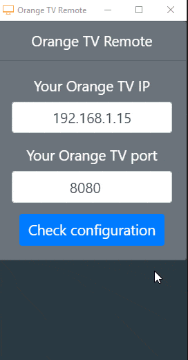

# orangetv-remote
An Orange TV remote app based on [electron](https://github.com/electron/electron). This app lets you control your Orange TV directly from your computer.

## Configure
Download required dependencies.
```console
yarn install
```

Start the app.
```console
yarn start
```

If you have troubles connecting with your TV, uncomment this line in *[main.js](./main.js)* so the developer tools will open when starting the app.
```js
// Open the DevTools.
// mainWindow.webContents.openDevTools()
```

## Build
Build this app for your system.
```console
yarn build
```

Build for all systems.
```console
yarn build_all
```

The `out/` directory will be created, containing your compiled application.

## Releases
If you don't want to go through the hassle of building the app yourself, you can download pre-compiled builds in the [releases tab](https://github.com/rigwild/orangetv-remote/releases). You don't need to install anything, it is a portable app.

## App showcase


## License
[The MIT license](https://github.com/rigwild/orangetv-remote/blob/master/LICENSE)
